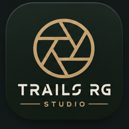

  

# Trails RG Studio — public downloads

Proprietary beta builds of **Trails RG Studio** (a Trails RG product; formerly Trails RG EXIF Tool).

- Website: https://www.trailsrg.com/apps
- Versions / notes: https://www.trailsrg.com/apps/studio/versions
- Terms: https://www.trailsrg.com/apps/studio/terms
- Privacy: https://www.trailsrg.com/apps/studio/privacy

Source code is **not** published here. This repository hosts release binaries only.

## Latest (1.0.0-beta.2 build 4)

| Platform | File |
|---|---|
| Android (arm64) | [Download APK](./dist/trails-rg-studio-1.0.0-beta.2-arm64.apk) |
| macOS | [Download zip](./dist/trails-rg-studio-1.0.0-beta.2-macos.zip) |

Checksums: [SHA256SUMS.txt](./dist/SHA256SUMS.txt)

On Samsung / Android, if install is blocked: **Settings → Security and privacy → Auto Blocker** (turn off), or install via `adb install -r …apk`.
